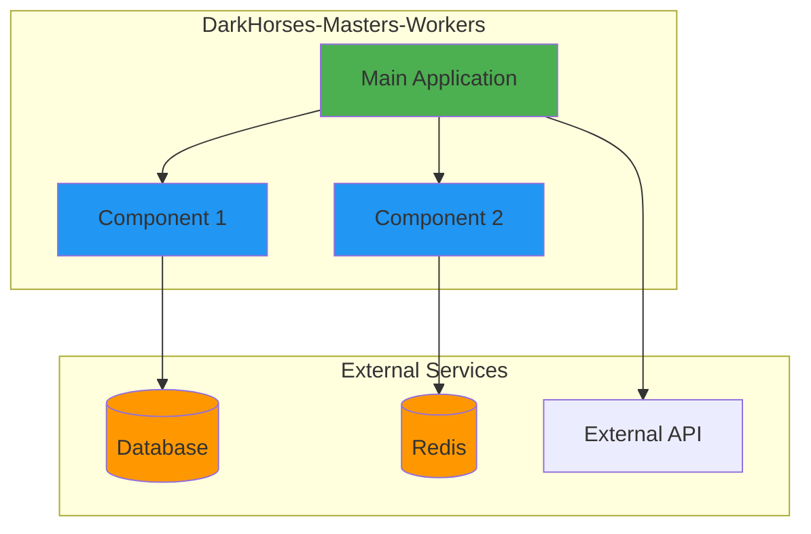
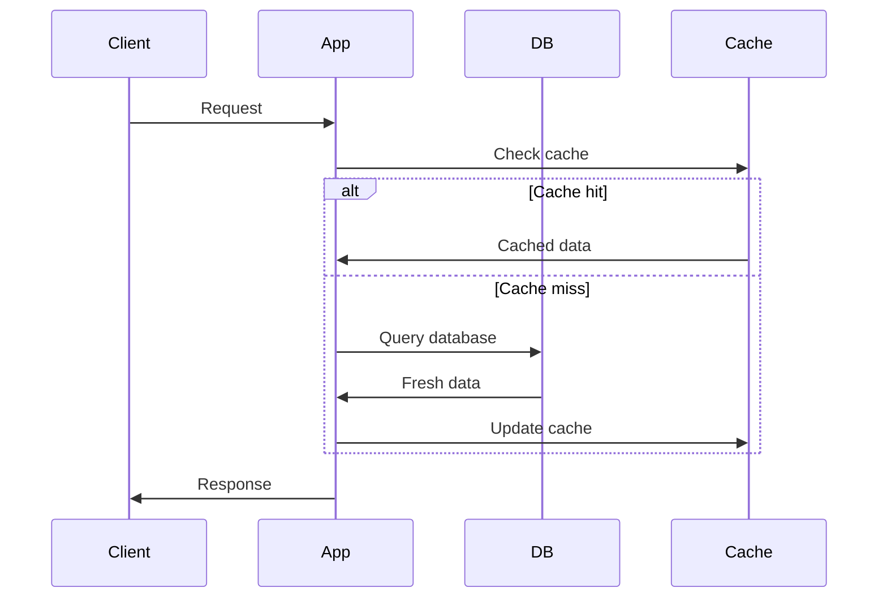
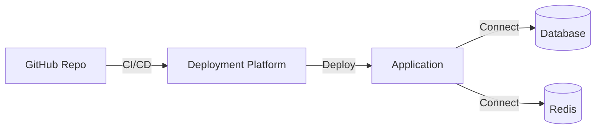

# DarkHorses-Masters-Workers Architecture

**Last Updated:** 2025-10-11
**Status:** Active Development

## Overview

Race masters data worker

## System Architecture



## Components

### Main Application

**Purpose:** Core application logic and orchestration

**Key Responsibilities:**
- Initialize services
- Handle configuration
- Coordinate components

### Component 1

**Purpose:** [Describe component purpose]

**Key Responsibilities:**
- [Responsibility 1]
- [Responsibility 2]

### Component 2

**Purpose:** [Describe component purpose]

**Key Responsibilities:**
- [Responsibility 1]
- [Responsibility 2]

## Data Flow



## Database Schema

### Main Tables

**table_name**
- `id` (Primary Key)
- `field1` (Type)
- `field2` (Type)
- `created_at` (Timestamp)
- `updated_at` (Timestamp)

## API Endpoints (if applicable)

### GET /endpoint
- **Description:** [What it does]
- **Parameters:** `param1`, `param2`
- **Response:** JSON

### POST /endpoint
- **Description:** [What it does]
- **Body:** JSON payload
- **Response:** Created resource

## Deployment



### Infrastructure

- **Platform:** [Render/Heroku/AWS/etc]
- **Database:** PostgreSQL
- **Cache:** Redis
- **Monitoring:** [Tool name]

## Configuration

### Environment Variables

```bash
# Required
DATABASE_URL=postgresql://...
REDIS_URL=redis://...

# Optional
LOG_LEVEL=INFO
WORKERS=4
```

### Feature Flags

- `FEATURE_A`: Enable feature A (default: false)
- `FEATURE_B`: Enable feature B (default: true)

## Security

### Authentication

[Describe authentication mechanism]

### Authorization

[Describe authorization/permissions]

### Secrets Management

- API keys stored in environment variables
- Never commit secrets to git
- Use secret management service in production

## Monitoring & Observability

### Logs

- **Level:** INFO in production, DEBUG in development
- **Format:** JSON structured logging
- **Destination:** [stdout/file/service]

### Metrics

- Request count
- Response time
- Error rate
- [Other metrics]

### Alerts

- High error rate (> 5%)
- Slow response time (> 2s)
- Database connection issues

## Performance

### Optimization Strategies

1. **Database queries:** Use indexes, avoid N+1
2. **Caching:** Redis for frequently accessed data
3. **Connection pooling:** Reuse database connections

### Scalability

- Horizontal scaling: Add more workers
- Vertical scaling: Increase resources per instance
- Database replication: Read replicas

## Development

### Local Setup

See [Quick Start Guide](QUICKSTART.md)

### Code Structure

```
DarkHorses-Masters-Workers/
├── src/
│   ├── main.py           # Entry point
│   ├── config.py         # Configuration
│   ├── models/           # Data models
│   ├── services/         # Business logic
│   └── utils/            # Utilities
├── tests/
│   ├── unit/
│   └── integration/
├── docs/
└── requirements.txt
```

### Testing Strategy

- **Unit tests:** Test individual functions/classes
- **Integration tests:** Test component interactions
- **E2E tests:** Test full workflows

## Future Improvements

- [ ] Improvement 1
- [ ] Improvement 2
- [ ] Improvement 3

## Related Projects

Part of the DarkHorses ecosystem:

- [DarkHorses-API](https://github.com/yourusername/DarkHorses-API)
- [DarkHorses-Frontend](https://github.com/yourusername/DarkHorses-Frontend)
- See [Master Architecture](https://notion.so/2890795b42db81cd89a9f1452f45e36d)

## Resources

- [Quick Start Guide](QUICKSTART.md)
- [API Reference](API_REFERENCE.md) (if applicable)
- [Contributing Guidelines](../CONTRIBUTING.md)
- [Notion Documentation](https://notion.so/2850795b42db80cbbe49eda4b40f7bbb)
