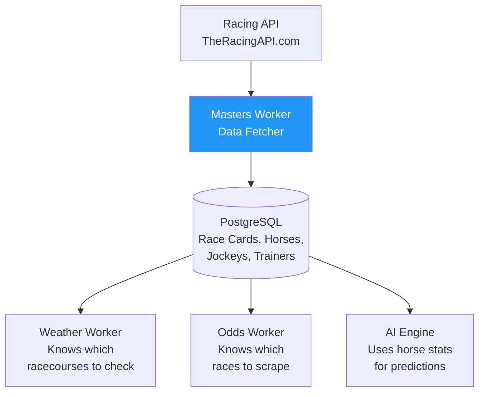

# 🎯 DarkHorses-Masters-Workers - The Idiot's Guide

> **TL;DR:** Python worker that fetches race cards, horse statistics, jockey/trainer info - the "who's racing" data

---

## 🤔 What Is This?

**In Plain English:** DarkHorses-Masters-Workers is a background service that collects the fundamental race information: which horses are running, their past performance records, jockey statistics, trainer win rates, and track conditions. This is the "master data" that everything else builds upon.

**Real-World Analogy:**
> 💡 Think of it like the **race program vendor** at the track - they hand you the official race card showing all the horses, their past wins/losses, who's riding them, and their breeding. Without this, you don't even know who's competing!

---

## 🎯 Why Does It Matter?

### The Problem
> **❌ Problem:** Before you can predict a race, you need to know the basics: Who's racing? What's their track record? Who's the jockey? Without this foundational data, you have nothing to predict.

### The Solution
> **✅ Solution:** This worker continuously fetches race schedules and detailed participant information from racing APIs. It's the first step in the data pipeline - everything else depends on this "master data."

---

## 🔄 How It Fits In The Ecosystem



**Data Flow:**
- 📥 **Gets data from:** Racing APIs (TheRacingAPI, Racing Post, etc.)
- ⚙️ **Processes:** Race schedules, horse profiles, historical performance, jockey/trainer stats
- 📤 **Sends data to:** PostgreSQL database (races, horses, jockeys, trainers tables)

---

## 📚 Key Concepts (In Plain English)

### 1. What This Project Does
A **Python API integration worker** that:
- **Fetches race schedules:** Today's and upcoming races across all UK racecourses
- **Gets race cards:** For each race, which horses are running (called "declarations")
- **Collects horse data:** Past performance, age, weight, breeding
- **Gathers people data:** Jockey win rates, trainer statistics

### 2. When It Runs
**Runs continuously 24/7** - wakes up every 10 minutes. Race cards often update as horses are withdrawn or late entries added, so it needs to check regularly.

### 3. Why It Matters
This is the **foundation** of the entire system:
- Without race schedules → Weather worker doesn't know where to check
- Without horse names → Odds worker can't match betting data
- Without historical stats → AI has no features to train on

---

## ⚙️ What Happens When It Runs?

**Simple 3-Step Flow:**

1. **Fetch race schedule:** Call Racing API → Get list of today's races
2. **For each race, get details:** Race time, distance, track type, prize money, race card (horses)
3. **Store everything:** Save races, horses, jockeys, trainers to database

**Real Example:**
> 💡 It's 10:00am and checking today's races:
>
> 1. Worker calls: `GET /api/racecards?date=2025-01-15`
> 2. Receives: 47 races today across 8 racecourses
> 3. For Ascot 2pm race:
>    ```json
>    {
>      "race_id": 123,
>      "course": "Ascot",
>      "time": "14:00",
>      "horses": [
>        {
>          "name": "Lightning Bolt",
>          "age": 4,
>          "jockey": "Ryan Moore",
>          "trainer": "Aidan O'Brien",
>          "past_wins": 12,
>          "past_races": 25
>        },
>        ...
>      ]
>    }
>    ```
> 4. Stores in database:
>    - `races` table: race_id=123, course="Ascot", time="14:00"
>    - `horses` table: horse_id=456, name="Lightning Bolt"
>    - `race_entries` table: links race 123 to horse 456
> 5. Goes back to sleep for 10 minutes

---

## 🚀 When Would You Use This?

**You should run this when:**
- ✅ You need to know which races are happening today
- ✅ You're running the full DarkHorses system in production
- ✅ You need horse/jockey/trainer statistics for predictions
- ✅ You want to populate the database with race information

**You DON'T need this if:**
- ❌ You're only analyzing historical data (already in database)
- ❌ You don't have access to a racing API
- ❌ You're testing a single component in isolation
- ❌ You're running a demo with static/fake data

---

## 🔗 Dependencies

**This project needs:**
- **Racing API access** - TheRacingAPI.com or Racing Post API (requires subscription)
- **API key** - authentication credentials for racing data
- **PostgreSQL Database** - stores all race/horse/jockey data
- **Python 3.10+** - runtime environment
- **APScheduler or Celery** - schedules the 10-minute interval

**Other projects that depend on this:**
- **DarkHorses-Weather-Race-Worker** - uses race schedule to know which racecourses need weather
- **DarkHorses-Odds-Workers** - uses race schedule to know which races to scrape odds for
- **DarkHorses-AI-Engine** - uses horse/jockey/trainer stats as prediction features
- **DarkHorses-API** - serves race cards to frontend for display
- **Everything!** - this is the master data source
